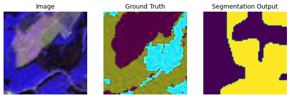
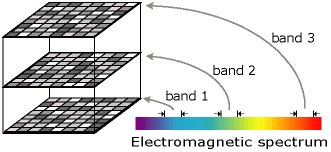
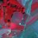
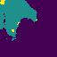

# Image Segmentation on Raster Data #
This repository deals with image segmentation task performed on raster data. The data is not trained from scratch and transfer learning is implemented to fine tune the pretrained model. This repo is based on the work done by @msminhas93 (https://github.com/msminhas93/DeepLabv3FineTuning/).

The objective was to perform accurate segmentation on the Multispectral raster data with the band order (4,3,2) and compare its results with the raster data (all bands). Currently, the results obtained are limited to raster data with band order (4,3,2). The result obtained is not currently satisfactory and work should be done to improvise.
The following is the sample result obtained: 



## Introduction ##
### Raster Data ###
Raster maps are divided into grid cells (pixels), where every cell may represent multiple information like temperature, magnitude, altitude and so on. Representing data in raster format has its own advantages like:
1. Uniformly storing multiple information which is useful for carrying out advanced and detailed statistical and spatial analysis.
2. Useful to perform surface analysis.
3. The Matrix Data structure uniformy stores information in the form of lines, points, plygons etc..

One of the few disadvantages that was observed is that Raster Grid Data when merged together requires huge amount of memory upto number of Gigabytes. The file ```merge.py``` deals with an attempt to stitch all the raster grid cell information to form one raster map for visualization. However, provided the dataset is too memory consuming (almost 230 gigs required).

### Raster Bands ###


(credits : https://desktop.arcgis.com/en/arcmap/10.3/manage-data/raster-and-images/raster-bands.htm)

Bands in raster data represents layers. Every layer has particular information (types of info mentioned above) stored in it. The band information is stored either in the form of binary image (grayscale), or color (RGB). The RGB color are defined in the band matrix.
Inorder to create a an RGB composite dataset, 3 bands information was stacked together. Have a look at the "data" folder in the repo.
Sample:

### Creating Dataset ###
The dataset is created using the files ```image_dataset.py``` and ```label_dataset.py```
image_dataset.py reads the specefic band information from the GeoTiff dataset provided. In our case we are concerned with band information 4,3,2. The bands are stacked together to form and RGB image and is written on disk, creating out custom dataset. 




### Usage ###
Usage : 
```
python main.py --data-directory data --exp_directory experiment --epochs 25 --batch-size 25
  --data-directory TEXT  Specify the data directory.  [required]
  --exp_directory TEXT   Specify the experiment directory.  [required]
  --epochs INTEGER       Specify the number of epochs you want to run the
                         experiment for. Default is 25.

  --batch-size INTEGER   Specify the batch size for the dataloader. Default is 4.
  --help                 Show this message and exit.
```

```vis.ipynb``` is used to visualize the model, plot the Loss vs epoch plot as well as the F1 score vs Epoch curve.
Further, the file can be used to test images by inputting them to the model (in which the trained weights are loaded).

## Important Notes ##

1. The task seems to be overfitting as the training Loss as well as the Test Loss seem to be pretty good, yet the predictions are not up to the standards.
2. Adding L2 regularization in the Adam optimizer by adding weight decay to the optimizer arg like : ```optimizer = torch.optim.Adam(model.parameters(), lr=1e-4, weight_decay = 1e-5)``` Increasing the weight decay parameter would increase the regularization parameter and help in reducing overfitting.
3. Increasing the augmenters in the transformation. Changes have to be done in ```datahandler.py``` 
   for example : ```data_transforms = transforms.Compose([transforms.RandomRotation(25), transforms.RandomResizedCrop(224), transforms.ToTensor()])```
3. Decreasing the number of layers (reducing architecture complexity) / Increase keep_prob parameter (probability of keeping a node in the training process) in Dropout regilarization / Implementing Early stopping. (Stopping the training process if the "parameter" is getting worse)
4. The second task of segmentation on all band images is not yet performed due to time constraint.

## Citation ##
Bibtex Entry:

@misc{minhas_2019, title={Transfer Learning for Semantic Segmentation using PyTorch DeepLab v3}, url={https://github.com/msminhas93/DeepLabv3FineTuning}, journal={GitHub.com/msminhas93}, author={Minhas, Manpreet Singh}, year={2019}, month={Sep}}

IEEE Format Citation:

M. S. Minhas, “Transfer Learning for Semantic Segmentation using PyTorch DeepLab v3,” GitHub.com/msminhas93, 12-Sep-2019. [Online]. Available: https://github.com/msminhas93/DeepLabv3FineTuning.